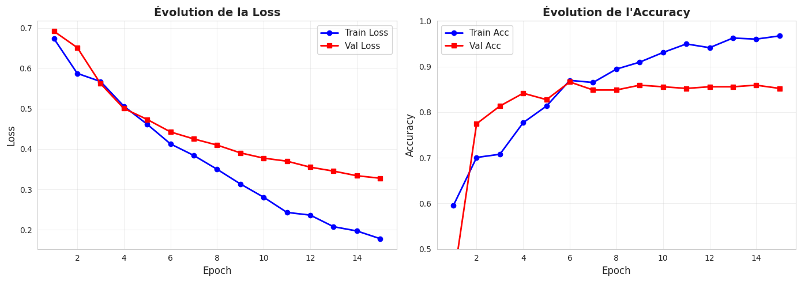
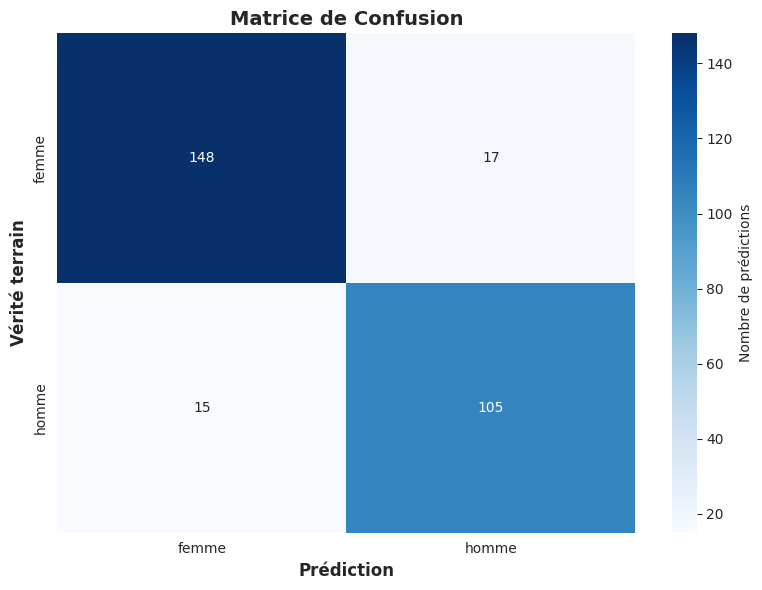

Architecture: 40000 → 64 → 32 → 2
Paramètres: 2,562,402
 Epoch 1/15 - Train: 0.595 | Val: 0.430  
 Epoch 2/15 - Train: 0.701 | Val: 0.775                                         
 Epoch 3/15 - Train: 0.708 | Val: 0.813 
 Epoch 4/15 - Train: 0.777 | Val: 0.842 
 Epoch 5/15 - Train: 0.813 | Val: 0.827 
 Epoch 6/15 - Train: 0.870 | Val: 0.866 
 Epoch 7/15 - Train: 0.865 | Val: 0.849 
 Epoch 8/15 - Train: 0.894 | Val: 0.849 
 Epoch 9/15 - Train: 0.910 | Val: 0.859 
 Epoch 10/15 - Train: 0.931 | Val: 0.856 
 Epoch 11/15 - Train: 0.950 | Val: 0.852 
 Epoch 12/15 - Train: 0.941 | Val: 0.856 
 Epoch 13/15 - Train: 0.962 | Val: 0.856 
 Epoch 14/15 - Train: 0.960 | Val: 0.859 
 Epoch 15/15 - Train: 0.967 | Val: 0.852 

 

 Test Accuracy: 0.8877

Rapport de classification:
              precision    recall  f1-score   support

       femme       0.91      0.90      0.90       165
       homme       0.86      0.88      0.87       120

    accuracy                           0.89       285
   macro avg       0.88      0.89      0.89       285
weighted avg       0.89      0.89      0.89       285

 
